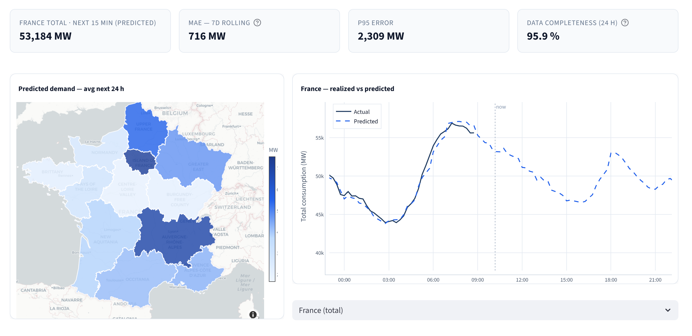

# elec-forecast


[](https://elec-dashboard-931951823998.europe-west9.run.app)

End-to-end ML pipeline for **day-ahead electricity demand forecasting** across 12 French metropolitan regions — running live on GCP.

**Live dashboard**: [elec-dashboard-931951823998.europe-west9.run.app](https://elec-dashboard-931951823998.europe-west9.run.app)



The dashboard shows four KPI cards (France total predicted MW, 7-day rolling MAE, p95 error, 24h data completeness), a choropleth map of predicted regional demand, and a 24-hour actual vs. predicted time series with a live "now" line.

---

## Overview

This project forecasts regional electricity consumption in France at 15-minute granularity, 24 hours ahead. The full pipeline runs autonomously on GCP free-tier infrastructure: data is ingested every 15 minutes from two public APIs, features are materialised into BigQuery, a LightGBM model is retrained daily on a rolling 90-day window, and predictions are served through a Streamlit dashboard with live monitoring metrics.

The goal is a production-grade ML system — not just a notebook — with proper data contracts, experiment tracking, scheduled jobs, monitoring, and a deployment pipeline.

---

## Architecture

```
ODRÉ API (eco2mix)  ─┐
                      ├─► [ingest]  ─► BQ elec_raw  ─► [features]  ─► BQ elec_features
Open-Meteo API     ─┘                                                        │
(historical weather)                                                          ▼
                                                                       [train] ──► GCS model artifact
                                                                              │         │
                                                                         MLflow DB  [forecast] ◄── Open-Meteo (live forecast)
                                                                       (SQLite/GCS)    │
                                                                                       ▼
                                                                            BQ elec_ml.predictions
                                                                                       │
                                                                                  [metrics]
                                                                                       │
                                                                                       ▼
                                                                            BQ elec_ml.metrics
                                                                                       │
                                                                                       ▼
                                                                         Streamlit dashboard (live)
```

**Data flow:**

```
Every 15 min:
  :00/:15/:30/:45  →  ingest   — fetch new eco2mix + weather → BQ raw
          +10 min  →  metrics  — rolling 7d MAE/p95/p99 → BQ elec_ml.metrics

Daily (Paris time):
  01:50  →  features — incremental feature store materialisation from raw
  02:00  →  train    — rolling 90-day window → LightGBM → MLflow + GCS
  06:00  →  forecast — eco history lags + Open-Meteo live forecast → 96×12 predictions → BQ

On-demand:
  backfill  →  historical eco2mix + weather → BQ raw (run before first train or after data reset)
```

---

## Stack

| Layer | Technology | Why |
|---|---|---|
| Compute | Cloud Run Jobs (batch) + Cloud Run Services (dashboard) | Scale to zero, no idle cost |
| Storage | BigQuery (raw, features, predictions) + GCS (model artifacts) | Serverless, free-tier friendly |
| Orchestration | Cloud Scheduler | Managed cron, no Airflow overhead |
| ML | LightGBM + scikit-learn | Fast training, strong tabular performance |
| Experiment tracking | MLflow self-hosted on Cloud Run | Portable, no vendor lock-in; SQLite on GCS avoids Cloud SQL cost |
| Dashboard | Streamlit on Cloud Run | Rapid iteration, Python-native |
| IaC | Terraform | Reproducible GCP provisioning (GCS, BQ, IAM, Scheduler, Secrets) |
| CI/CD | Cloud Build + Artifact Registry | Native GCP, triggered via `deploy.ps1` |
| Region | europe-west9 (Paris) | Co-located with data source |

---

## Data Sources

### ODRÉ eco2mix (`eco2mix-regional-tr`)
- **Provider**: [Open Data Réseaux Énergies](https://odre.opendatasoft.com/)
- **License**: Licence Ouverte v2.0 (Etalab) — no API key required
- **Granularity**: 15-minute intervals, ~7h publication lag
- **Coverage**: 12 metropolitan French regions, back to 2013 (historical dataset)
- **Fields used**: `date_heure`, `libelle_region`, `consommation` (MW)

### Open-Meteo
- **Provider**: [open-meteo.com](https://open-meteo.com/) — free, no auth
- **Granularity**: Hourly per region centroid (joined to 15-min eco2mix by `TIMESTAMP_TRUNC(date_heure, HOUR)`)
- **Fields**: `temperature_2m` (°C), `wind_speed_10m` (km/h), `direct_radiation` (W/m²)

---

## Feature Engineering

Features are computed in BigQuery SQL (single round-trip) then augmented in Python:

| Feature | Description |
|---|---|
| `region` | French region — encoded as `pd.Categorical` with fixed sorted category list (consistent between train and forecast) |
| `consommation_lag_24h` | Consumption same time yesterday |
| `consommation_lag_48h` | Consumption same time 2 days ago |
| `consommation_lag_168h` | Consumption same time last week |
| `consommation_rolling_168h` | 7-day rolling average |
| `temperature_celsius` | Regional temperature at nearest hour |
| `wind_speed_kmh` | Regional wind speed at nearest hour |
| `solar_radiation_wm2` | Direct radiation at nearest hour |
| `hour_of_day` | 0–23 (Europe/Paris local time) |
| `day_of_week` | 0=Mon … 6=Sun |
| `month` | 1–12 |
| `is_weekend` | Boolean |
| `is_public_holiday_fr` | Boolean (via `holidays` library) |

---

## ML Model

- **Algorithm**: LightGBM regressor (gradient boosted trees)
- **Target**: `consommation` (MW) at each 15-min slot, per region
- **Horizon**: 24 hours ahead (96 slots × 12 regions = 1,152 predictions per scoring run)
- **Experiment tracking**: MLflow — each training run logs parameters, metrics (RMSE, MAE), and the model artifact
- **Artifact storage**: `gs://elec-forecast-931951823998/models/{run_id}/model.lgb`
- **Model registry**: MLflow tracking DB (SQLite) persisted on GCS, downloaded/uploaded at job boundaries

---

## Dashboard

Live Streamlit dashboard showing:

- **KPI row**: France total predicted MW (next slot), data completeness (24h), rolling 7d MAE, p95/p99 error from `elec_ml.metrics`
- **Pipeline freshness**: colour-coded badges for ingest/features (20/60 min thresholds) and forecast (26 h threshold for daily job)
- **Regional map**: folium map of France — circle size and opacity encode predicted demand per region
- **Time series**: fixed 24h day view (Paris midnight → midnight), actuals fill from left, "now" line moves through day, predictions extend to right; selectable per region or France total

---

## Repo Layout

```
elec-forecast/
├── jobs/
│   ├── elec_jobs/
│   │   ├── ingest/run.py          # eco2mix + weather → BQ raw
│   │   ├── features/run.py        # raw → feature store (BQ SQL + Python); FEATURES_SINCE for reset
│   │   ├── train/run.py           # features → LightGBM + MLflow + GCS
│   │   ├── forecast/run.py        # daily: eco lags + Open-Meteo live → 96×12 predictions → BQ
│   │   ├── metrics/run.py         # rolling 7d MAE/p95/p99 → BQ elec_ml.metrics
│   │   ├── backfill/run.py        # historical eco2mix + weather → BQ raw (manual, no trigger)
│   │   ├── shared/
│   │   │   ├── config.py          # env-based config + region centroids
│   │   │   ├── bq.py              # BQ client + merge_to_bq (UPSERT helper)
│   │   │   └── gcs.py             # GCS upload/download helpers
│   │   └── __main__.py            # Docker entrypoint (JOB_MODULE env var)
│   └── pyproject.toml
├── apps/
│   ├── dashboard/
│   │   ├── app.py                 # Streamlit dashboard
│   │   ├── requirements.txt
│   │   └── Dockerfile
│   └── mlflow/                    # Self-hosted MLflow server (WIP)
├── infra/
│   ├── cloudrun/
│   │   ├── Dockerfile.jobs        # Single image for all 6 jobs
│   │   ├── cloudbuild.yaml        # Cloud Build — builds images tagged :{SHA} + :latest
│   │   └── deploy.ps1             # Build + deploy all Cloud Run Jobs + dashboard
│   ├── sql/ddl/                   # BigQuery DDL (reference; Terraform is authoritative)
│   └── terraform/                 # All GCP resources — single source of truth
│       ├── main.tf                # Provider + GCS backend
│       ├── apis.tf / iam.tf / storage.tf / registry.tf
│       ├── bigquery.tf / secrets.tf / scheduler.tf
│       ├── imports.tf             # Import blocks for existing resources
│       └── schemas/               # BQ table schemas as JSON
├── contracts/
│   ├── schemas.md                 # Human-readable table schemas
│   └── features.yaml              # Feature registry
├── .env.example
├── CLAUDE.md                      # Project context for Claude Code
└── TODO.md
```

---

## Getting Started

### Prerequisites
- Python 3.11+
- [gcloud CLI](https://cloud.google.com/sdk/docs/install) authenticated
- GCP project with billing enabled (free tier sufficient)

### 1. Clone and create venv

```powershell
git clone <repo>
cd elec-forecast
python -m venv .venv
.\.venv\Scripts\Activate.ps1
pip install -e jobs/[dev]
```

### 2. Configure environment

```powershell
Copy-Item .env.example .env
# Fill in: GCP_PROJECT_ID, GCS_BUCKET
```

### 3. Provision GCP resources with Terraform

Creates all GCP resources: APIs, IAM service account, GCS bucket, Artifact Registry, BQ datasets + tables, Secret Manager secrets, Cloud Scheduler jobs. Terraform state is stored in the project's own GCS bucket.

```powershell
gcloud auth login
gcloud auth application-default login
gcloud config set project <PROJECT_ID>
cd infra/terraform
terraform init
terraform apply
```

### 4. Backfill historical data

Populates BQ raw tables with 2 years of eco2mix + weather before the first training run:

```powershell
.\scripts\full_pipeline.ps1   # truncate → backfill → features → train → forecast
```

Or run steps individually — see `scripts/full_pipeline.ps1` for env vars.

### 5. Deploy to Cloud Run

Builds Docker images via Cloud Build and deploys 6 Cloud Run Jobs + dashboard Service.

```powershell
.\infra\cloudrun\deploy.ps1
```

### 6. Run jobs locally

```powershell
# Activate venv and set env vars
$env:JOB_MODULE = "ingest"   # or features / train / forecast / metrics / backfill
python -m elec_jobs
```

---

## Jobs

| Job | Schedule (Paris) | Description |
|---|---|---|
| `ingest` | `*/15 * * * *` | Pull new eco2mix records + weather → BQ raw (UPSERT) |
| `features` | `50 1 * * *` (daily 01:50) | Incremental feature materialisation from raw (lags, rolling avg, calendar) → BQ feature store |
| `train` | `0 2 * * *` (daily 02:00) | Train LightGBM on rolling 90-day window, log to MLflow, push model to GCS |
| `forecast` | `0 6 * * *` (daily 06:00) | Eco history lags + Open-Meteo live forecast → 96×12 predictions → UPSERT `elec_ml.predictions` |
| `metrics` | `10,25,40,55 * * * *` | predictions × actuals → rolling 7d MAE/p95/p99 → UPSERT `elec_ml.metrics` |
| `backfill` | Manual only | Historical eco2mix + weather → BQ raw; use before first train or after a data reset |

Features and train run daily (not weekly) to keep the model fresh; the 90-day rolling window focuses training on recent patterns while covering full seasonal variation.

All jobs share a single Docker image (`Dockerfile.jobs`); the `JOB_MODULE` environment variable selects the entry point. Images are tagged both `:{git-sha}` (audit trail) and `:latest` (stable reference for Cloud Run).

---

## GCP Resources

| Resource | Value |
|---|---|
| Project | `elec-forecast` (`931951823998`) |
| Region | `europe-west9` (Paris) |
| GCS bucket | `elec-forecast-931951823998` |
| Artifact Registry | `europe-west9-docker.pkg.dev/elec-forecast/elec-forecast` |
| Service account | `elec-forecast-sa@elec-forecast.iam.gserviceaccount.com` |
| BQ datasets | `elec_raw`, `elec_features`, `elec_ml` |
| Scheduler region | `europe-west1` (Cloud Scheduler availability constraint) |

---

## Roadmap

- [x] Terraform for all GCP resources (GCS, BQ, IAM, Scheduler, Secrets, Artifact Registry)
- [x] Dashboard redesign — contact header, system check badges (Ingest/Features/Forecast/Retrain/Eval), orange "now" line, France-total KPI tooltips
- [x] Forecast lag alignment fix — inference features aligned to T=slot-24h matching training convention
- [x] Fixed forecast window — always anchored at 06:00 Paris regardless of job start time
- [x] Daily retrain pipeline — features 01:50 → train 02:00 → forecast 06:00; rolling 90-day training window
- [x] Backfill pipeline — `backfill` job + `scripts/full_pipeline.ps1` for full data reset
- [x] GitHub → Cloud Build trigger (CI on push to main)
- [ ] MLflow server on Cloud Run (self-hosted experiment tracking UI)
- [ ] Drift monitoring: PSI/KS test on feature distributions, rolling MAE vs baseline
- [ ] Automated retrain policy: trigger when 7-day MAE exceeds threshold
- [ ] Data retention: BQ partition expiry (raw 90d, features 30d) + GCS model rotation (keep last 3)
- [ ] Unit tests (mock ODRÉ API, feature computation)
